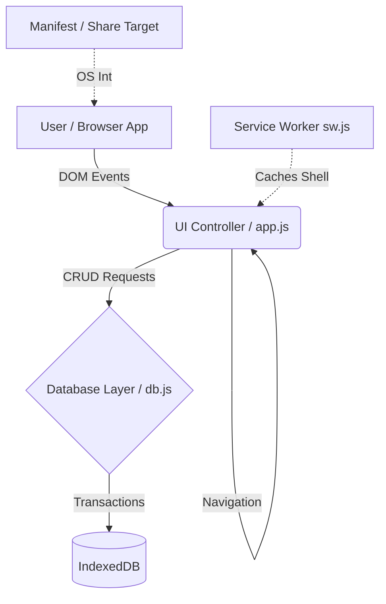

# QuickSave PWA — Technical Documentation

**QuickSave** is a Progressive Web App (PWA) designed for rapid offline knowledge capture directly from mobile devices. This document outlines the application architecture, data workflow, technology stack, and strategies to scale the platform in the future.

---

## 1. Architecture Overview

QuickSave utilizes a **Client-Side Heavy Architecture** (Local-First). 
All application logic, routing (view switching), state management, and data persistence take place entirely within the user's browser runtime. There is zero reliance on an external cloud database or backend API for core functionality.

## 2. Technology Stack

Because speed and broad compatibility are prioritized over complex tooling, the stack relies strictly on native web technologies:

### Frontend Layer
- **HTML5:** Semantic markup, leveraging modern HTML5 form validation.
- **CSS3 (Vanilla):** A custom dark glassmorphic design system using CSS Variables (`--var`). No preprocessors or utility frameworks (like Tailwind) were used to minimize the payload.
- **JavaScript (ES6+):** Vanilla JavaScript handles DOM manipulation, event listening, and view transitions.

### PWA Engine
- **Web App Manifest (`manifest.json`):** Defines the metadata for installing the app to the OS home screen (icons, theme color, standalone display mode). Crucially, configures the `share_target` array to register the web app as a native share destination on Android devices.
- **Service Worker (`sw.js`):** Intercepts network requests to serve the initial application shell (`index.html`, CSS, JS) from the local cache, making the app function seamlessly offline.

### Storage Layer
- **IndexedDB:** An asynchronous, deeply integrated browser API used to store large amounts of structured data on the client. It handles the persistence of link objects, bypassing the 5MB limits and synchronous blocking issues of `localStorage`.

---

## 3. Data Workflow

### 3.1 Standard Write Flow (Manual Save)
1. User interacts with `#save-form` in the Save View.
2. `app.js` runs URL validation and auto-detects the link type (GitHub, Paper, Tweet, etc.).
3. `app.saveItem()` is dispatched, transforming raw input into a structured JavaScript payload.
4. `db.js` opens an asynchronous IDBTransaction.
5. The payload is committed to the `saves` object store in IndexedDB.
6. A success UI overlay triggers, and the Dashboard charts re-render.

### 3.2 Share Target Write Flow (OS Integrated)
1. User clicks the native "Share" button from an external application (e.g., Twitter/X) on Android.
2. The Android OS maps the intent to the `share_target` defined in the PWA manifest.
3. QuickSave immediately opens (often as a bottom sheet or full-screen intent), passing the URL as a query parameter (e.g., `?url=...`).
4. `app.js` extracts the query parameters during initialization and populates the `#url` input.

### 3.3 Query Flow (Read / Search)
1. The user navigates to the Browse View.
2. `db.getAll()` is executed. It opens a read-only transaction on IndexedDB.
3. If search text or a tag filter is active, the dataset is iterated locally using JavaScript `.filter()` methods.
4. The remaining results are mapped to HTML strings and appended to the `#saved-list` DOM container.

---

## 4. Scalability & Future Architecture Path

While the current local-first architecture is lightning fast, it limits the user to a single device (data is not synced between their phone and desktop). To scale this project into a multi-device SaaS, we would transition to a **Cloud-Synchronized Local-First** hybrid architecture.

### Phase 1: Authentication & Serverless Backend
- **Auth:** Implement Firebase Auth or Supabase Auth to track users.
- **API:** Node.js/Express or Serverless Functions (Vercel Functions/AWS Lambda) exposing a RESTful API.
- **Cloud Database:** Introduce a scalable database like PostgreSQL (via Supabase) or MongoDB Atlas.

### Phase 2: Offline-First Synchronization
Instead of replacing IndexedDB, we adapt it to sync with the cloud:
1. The app continues to read/write instantaneously to **IndexedDB first** (Zero Latency UI).
2. A background synchronization worker queues any changes (new saves, deletes).
3. When the device detects network connectivity (`navigator.onLine`), it batches the queued changes to the Serverless API.
4. The API updates the Cloud Database, then returns a highly optimized delta payload to sync the local device state with the cloud truth.

### Phase 3: Enhanced Analytics & AI Categorization
- **AI Categorization (Backend):** As URLs hit the cloud API, trigger an LLM (Large Language Model) to fetch the webpage content and auto-generate detailed tags/summaries. Sync these new "rich" tags back down to the user's phone.
- **Full Text Search Indexing:** Move complex natural-language searching off the main JS thread by indexing titles and notes into search engines like Algolia or using Postgres `tsvector` text-search functionality.
